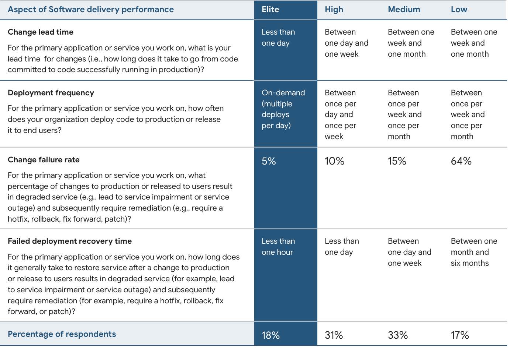

# OpenTelemetry Workshop 2024-06-26-Wed

Aspire is a .NET backend for OT. Is there a non-.NET alternative? Java/Kotlin?

- known-knowns: stuff we know can go wrong (unit tests)
- known-unknowns: stuff we think may go wrong (metrics/logs)
- unknown-unknowns: stuff we don't know could go wrong

Stop focusing on pillars; it's about asking questions and getting answers. Hence adding telementry.

10% of problems will take 90% of your time. Using Intersectional Analysis will help with this.

ODD: Observability Driven Development - its purpose is faster feedback loop.

DORA Scale from Google:

> See where NAIC falls on this scale

OpenTelemetry is the #1 standard by the CNCF. It differs from Prometheus in that it is all about pushes rather than scraping. It also is fundamentally different as it is a standard and has SDKs.

Traces have "Spans". Spans are structured blob of data that has uniqueID (spanId), correlationId (traceId), and duration. It also has a timestamp and causalityId (ParentSpanID).

incoming traffic instrumentation is handled by flask (in my case), if outgoing it's http instrumentation, database it's sql instrumentation, etc.

## Propagation

Each app sends its own trace data back to the app collecting it. We need to make sure they're using the right traceIds

WC3 Trace Headers
- Version
- TraceId
- ParentSpanId
- Sampling

## Baggage

Passing data between distributed systems. It's not telemetry itself but it influences it.

Can be very dangerous because it goes everywhere. Every 3rd party service you call will be sent the baggage. It's very easy for the objects passed around to contain excessive amount of data and even PII.

